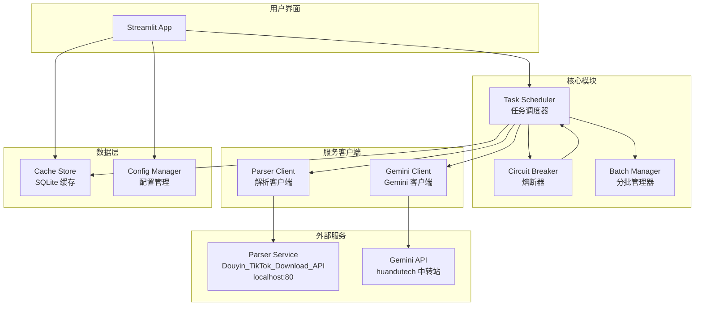
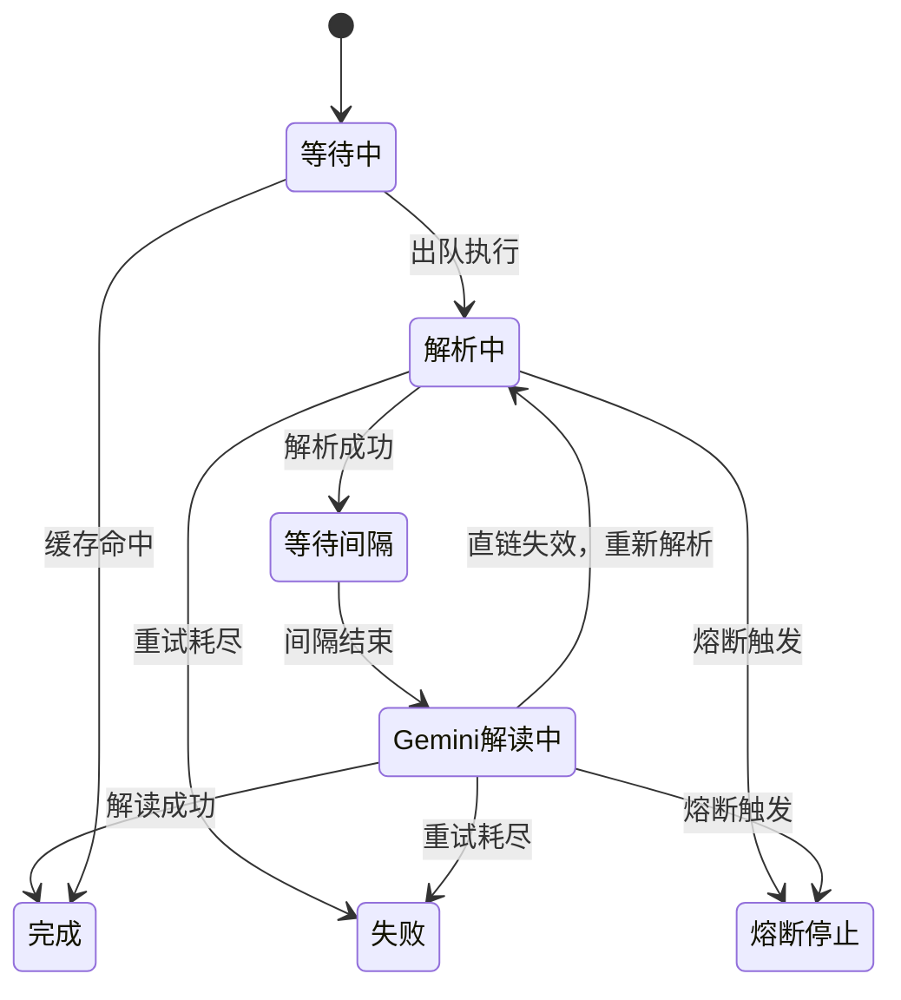

# 设计文档

## 概述

video2prompt 是一个基于 Python + Streamlit 的本地批量视频解读工具。系统从抖音视频链接出发，经过解析服务获取视频直链，再通过 Gemini 中转站 API 进行视频内容解读，最终导出 Excel 结果。

核心设计目标：
- 面向非技术用户的简洁 Web 界面
- 保守的风控策略（随机间隔、指数退避、熔断、分批）
- SQLite 本地缓存实现去重与结果复用
- 模块化架构，各组件职责单一

技术栈：
- **界面层**：Streamlit
- **HTTP 客户端**：httpx（支持异步）
- **数据库**：SQLite（通过 aiosqlite 异步访问）
- **Excel 导出**：openpyxl
- **配置管理**：python-dotenv + PyYAML
- **异步运行时**：asyncio

## 架构

### 系统架构图



### 任务状态机



## 组件与接口

### 1. ConfigManager（配置管理器）

负责加载 `.env` 和 `config.yaml`，提供运行时配置覆盖能力。

```python
class ConfigManager:
    """配置管理器，加载 .env 敏感配置与 config.yaml 业务配置"""

    def __init__(self, env_path: str = ".env", config_path: str = "config.yaml"):
        ...

    def get_gemini_api_key(self) -> str:
        """获取 GEMINI_API_KEY，缺失时抛出 ConfigError"""
        ...

    def get_config(self) -> AppConfig:
        """获取当前生效的配置（含运行时覆盖）"""
        ...

    def override(self, **kwargs) -> None:
        """运行时覆盖配置项，不回写文件"""
        ...
```

### 2. ParserClient（解析客户端）

封装对 Douyin_TikTok_Download_API 的 HTTP 调用和选链逻辑。

```python
class ParserClient:
    """解析服务客户端，负责调用解析 API 并提取视频直链"""

    def __init__(self, base_url: str, http_client: httpx.AsyncClient):
        ...

    async def parse_video(self, url: str) -> ParseResult:
        """调用解析 API 获取视频数据"""
        ...

    def select_video_url(self, video_data: dict) -> str:
        """
        从解析结果中选取最优视频直链。
        策略：bit_rate 数组中 H264 + ≤1080p + 最高码率 → play_addr_h264 → play_addr
        禁止使用 download_addr（含水印）
        """
        ...
```

### 3. GeminiClient（Gemini 客户端）

封装对 huandutech 中转站原生 Gemini 格式 API 的调用。

```python
class GeminiClient:
    """Gemini 视频解读客户端，使用原生 Gemini 格式 API"""

    DEFAULT_USER_PROMPT = "按要求解析视频并输出 sora 提示词"

    def __init__(self, base_url: str, model: str, api_key: str, http_client: httpx.AsyncClient):
        ...

    def set_default_user_prompt(self, prompt: str) -> None:
        """设置可由页面自定义的 DEFAULT_USER_PROMPT"""
        ...

    async def interpret_video(self, video_uri: str, user_prompt: str) -> str:
        """
        调用 generateContent 接口解读视频。
        使用 fileData.fileUri 传入视频直链。
        """
        ...

    def build_request_body(self, video_uri: str, user_prompt: str) -> dict:
        """构建原生 Gemini 格式请求体"""
        ...
```

### 4. CircuitBreaker（熔断器）

独立监控解析服务和 Gemini 服务的失败状态。

```python
class CircuitBreaker:
    """熔断器，监控连续失败次数和时间窗口失败率"""

    def __init__(self, consecutive_threshold: int, rate_threshold: float,
                 window_seconds: int = 300):
        ...

    def record_success(self) -> None:
        """记录一次成功，重置连续失败计数"""
        ...

    def record_failure(self) -> None:
        """记录一次失败，更新连续失败计数和时间窗口"""
        ...

    def is_tripped(self) -> bool:
        """检查是否触发熔断"""
        ...

    def reset(self) -> None:
        """重置熔断器状态（用于"继续"操作）"""
        ...
```

### 5. TaskScheduler（任务调度器）

核心编排模块，管理任务队列、并发控制、退避策略、状态流转。

```python
class TaskScheduler:
    """任务调度器，编排解析→Gemini 的完整流程"""

    def __init__(self, parser: ParserClient, gemini: GeminiClient,
                 cache: CacheStore, config: AppConfig,
                 parser_breaker: CircuitBreaker, gemini_breaker: CircuitBreaker):
        ...

    async def run_batch(self, tasks: list[Task], on_update: Callable) -> None:
        """执行一个批次的任务"""
        ...

    async def execute_task(self, task: Task) -> None:
        """执行单条任务的完整流程：缓存检查 → 解析 → Gemini"""
        ...

    async def _backoff_wait(self, service: str, attempt: int) -> None:
        """按退避序列等待"""
        ...
```

### 6. BatchManager（分批管理器）

将大量任务拆分为批次，管理批次间休息。

```python
class BatchManager:
    """分批管理器，控制批次拆分和批次间休息"""

    def __init__(self, batch_size: int, rest_min: float, rest_max: float):
        ...

    def split_batches(self, tasks: list[Task]) -> list[list[Task]]:
        """将任务列表拆分为批次"""
        ...

    async def wait_between_batches(self, on_countdown: Callable, cancel_event: asyncio.Event,
                                    skip_event: asyncio.Event) -> None:
        """批次间随机休息，支持跳过和取消"""
        ...
```

### 7. CacheStore（缓存存储）

基于 SQLite 的本地缓存，存储解析结果和 Gemini 解读结果。

```python
class CacheStore:
    """SQLite 缓存存储，支持去重与结果复用"""

    def __init__(self, db_path: str = "cache.db"):
        ...

    async def init_db(self) -> None:
        """初始化数据库表结构"""
        ...

    async def get_cached_result(self, link_hash: str) -> CachedResult | None:
        """查询缓存，返回 None 表示未命中"""
        ...

    async def save_result(self, link_hash: str, aweme_id: str,
                          video_url: str, gemini_output: str) -> None:
        """保存解析结果和 Gemini 输出到缓存"""
        ...

    async def save_system_prompt(self, prompt: str) -> None:
        """持久化 DEFAULT_USER_PROMPT（表名沿用 system_prompt）"""
        ...

    async def load_system_prompt(self) -> str | None:
        """加载上次保存的 DEFAULT_USER_PROMPT"""
        ...
```

### 8. ExcelExporter（Excel 导出器）

基于模板生成 Excel 导出文件。

```python
class ExcelExporter:
    """Excel 导出器，基于模板生成结果文件"""

    def __init__(self, template_path: str = "docs/product_prompt_template.xlsx"):
        ...

    def export(self, tasks: list[Task], output_path: str) -> None:
        """将任务结果导出为 Excel 文件"""
        ...

    @staticmethod
    def generate_filename() -> str:
        """生成 video2prompt-{YYYYMMDDHHmmss}.xlsx 格式的文件名"""
        ...
```


### 9. InputValidator（输入校验器）

负责批量输入的解析和校验逻辑。

```python
class InputValidator:
    """输入校验器，解析和校验 pid/链接的批量输入"""

    VALID_DOMAINS = ["douyin", "iesdouyin"]

    @staticmethod
    def parse_lines(pid_text: str, link_text: str) -> list[TaskInput]:
        """
        解析两个文本框的输入，按行对齐。
        自动忽略两边同时为空的行。
        """
        ...

    @staticmethod
    def validate_link(link: str) -> bool:
        """校验链接是否包含有效的抖音域名"""
        ...

    @staticmethod
    def validate_line_count(pid_lines: list[str], link_lines: list[str]) -> ValidationResult:
        """校验两个输入框的非空行数是否一致"""
        ...
```

## 数据模型

### 核心数据结构

```python
from dataclasses import dataclass, field
from enum import Enum
from datetime import datetime


class TaskState(Enum):
    """任务状态枚举"""
    WAITING = "等待中"
    PARSING = "解析中"
    INTERVAL = "等待间隔"
    INTERPRETING = "Gemini解读中"
    COMPLETED = "完成"
    FAILED = "失败"
    CIRCUIT_BREAK = "熔断停止"


@dataclass
class Task:
    """单条任务"""
    pid: str
    original_link: str
    aweme_id: str = ""
    video_url: str = ""
    state: TaskState = TaskState.WAITING
    parse_retries: int = 0
    gemini_retries: int = 0
    error_message: str = ""
    gemini_output: str = ""
    start_time: datetime | None = None
    end_time: datetime | None = None
    batch_number: int = 0
    cache_hit: bool = False


@dataclass
class ParseResult:
    """解析结果"""
    aweme_id: str
    video_url: str
    raw_data: dict


@dataclass
class CachedResult:
    """缓存条目"""
    link_hash: str
    aweme_id: str
    video_url: str
    gemini_output: str
    created_at: datetime


@dataclass
class TaskInput:
    """校验后的单行输入"""
    pid: str
    link: str
    is_valid: bool = True
    error: str = ""


@dataclass
class ValidationResult:
    """输入校验结果"""
    is_valid: bool
    error_message: str = ""
    pid_count: int = 0
    link_count: int = 0


@dataclass
class AppConfig:
    """应用配置"""
    # Gemini
    gemini_base_url: str = "https://api.huandutech.com"
    gemini_model: str = "gemini-3-flash-preview"
    # Parser
    parser_base_url: str = "http://localhost:80"
    parser_concurrency: int = 3
    parser_delay_min: float = 1.5
    parser_delay_max: float = 4.0
    # 退避序列
    parser_backoff_sequence: list[int] = field(default_factory=lambda: [10, 30, 120, 300])
    gemini_backoff_sequence: list[int] = field(default_factory=lambda: [5, 15, 60, 180])
    # 熔断
    parser_consecutive_failures: int = 8
    parser_failure_rate: float = 0.6
    gemini_consecutive_failures: int = 5
    gemini_failure_rate: float = 0.5
    circuit_breaker_window: int = 300  # 5分钟
    # 批次
    batch_size: int = 100
    batch_rest_min: float = 5.0  # 分钟
    batch_rest_max: float = 15.0  # 分钟
    # 任务完成间隔
    task_completion_delay_min: float = 0.8
    task_completion_delay_max: float = 2.0
```

### SQLite 表结构

```sql
-- 缓存表：存储链接解析结果和 Gemini 输出
CREATE TABLE IF NOT EXISTS cache (
    link_hash TEXT PRIMARY KEY,
    aweme_id TEXT NOT NULL,
    video_url TEXT NOT NULL,
    gemini_output TEXT NOT NULL DEFAULT '',
    created_at TIMESTAMP DEFAULT CURRENT_TIMESTAMP,
    updated_at TIMESTAMP DEFAULT CURRENT_TIMESTAMP
);

-- DEFAULT_USER_PROMPT 持久化表（表名沿用 system_prompt）
CREATE TABLE IF NOT EXISTS system_prompt (
    id INTEGER PRIMARY KEY CHECK (id = 1),
    content TEXT NOT NULL DEFAULT '',
    updated_at TIMESTAMP DEFAULT CURRENT_TIMESTAMP
);
```

### Gemini API 请求/响应格式

请求体（原生 Gemini 格式）：
```json
{
  "contents": [{
    "role": "user",
    "parts": [
      {
        "fileData": {"mimeType": "video/mp4", "fileUri": "{video_cdn_url}"},
        "videoMetadata": {"fps": 2.0}
      },
      {"text": "{default_user_prompt}"}
    ]
  }]
}
```

响应体关键字段：
```json
{
  "candidates": [{
    "content": {
      "parts": [{"text": "Gemini 解读输出文本"}],
      "role": "model"
    }
  }]
}
```

### Parser API 响应中的选链路径

```
data.video.bit_rate[]  →  筛选 is_h265==0 且 height<=1080  →  按 bit_rate 降序  →  [0].play_addr.url_list[0]
                           ↓ 无符合条目
data.video.play_addr_h264.url_list[0]
                           ↓ 不存在
data.video.play_addr.url_list[0]

⚠️ 禁止使用 download_addr（含水印）
```
