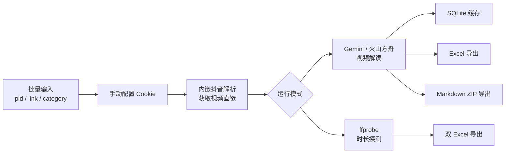

# video2prompt

<div align="center">

本地批量抖音视频解析与 AI 解读工具


[功能亮点](#功能亮点) • [快速开始](#快速开始) • [运行模式](#运行模式) • [配置说明](#配置说明) • [开发与测试](#开发与测试) • [故障排查](#故障排查)

</div>

`video2prompt` 用来批量处理抖音链接：先通过内嵌抖音解析模块拿到视频直链，再按所选模式执行 AI 解读或 `ffprobe` 时长探测，最后导出 Excel 或 Markdown ZIP。

它适合这些场景：

- 批量生成短视频复刻提示词
- 审查视频是否适合翻译搬运
- 按类目沉淀脚本素材
- 快速筛掉时长超过 15 秒的视频

> [!IMPORTANT]
> `scripts/start.sh` 不会自动激活虚拟环境。请先执行 `. .venv/bin/activate`，再启动应用。

## 功能亮点

- 批量输入 `pid + 链接`，自动解析无水印视频直链并执行后续流程
- 内嵌 Douyin-only 解析，不再依赖额外 HTTP 解析服务
- 支持手动粘贴并持久化抖音 Cookie，重启应用后仍可继续使用
- 支持 `Gemini` 和 `火山方舟（Volcengine / Seed 2.0）` 两种模型服务商
- 内置三种运行模式：`视频复刻提示词`、`按类目分析`、`视频时长判断`
- 支持结构化“能否翻译”审查，覆盖儿童口播、多人口播、价格促销、字幕、贴纸/花字等维度
- 本地 SQLite 缓存，避免相同链接 + Prompt 重复调用模型
- 带重试、退避、熔断、限流慢启动和手动停止能力
- 支持 Excel 导出，按类目模式还可导出 Markdown ZIP
- Excel 导出结果可直接用于下游整理，默认模板位于 `docs/product_prompt_template.xlsx`

## 工作流



## 快速开始

### 1. 准备环境

前置条件：

- Python `3.11+`
- 可用的抖音网页 Cookie（首次启动后在页面内手动粘贴保存）
- 如果要使用“视频时长判断”模式，需要 `ffprobe`
- 如果要使用 AI 解读模式，需要 `GEMINI_API_KEY` 或 `VOLCENGINE_API_KEY` / `ARK_API_KEY`

> [!NOTE]
> “视频时长判断”模式不会调用模型，因此不需要 AI API Key，但仍然需要已配置的抖音 Cookie。

### 2. 创建虚拟环境并安装依赖

```bash
python3 -m venv .venv
. .venv/bin/activate
python -m ensurepip --upgrade
python -m pip install --upgrade pip setuptools wheel
python -m pip install -e ".[dev]"
```

### 3. 配置环境变量

```bash
cp .env.example .env
```

`.env` 中按需填写：

```env
GEMINI_API_KEY=your_api_key_here
VOLCENGINE_API_KEY=your_volcengine_api_key_here
ARK_API_KEY=your_ark_api_key_here
```

### 4. 检查 `config.yaml`

项目默认通过 `config.yaml` 控制模型服务商、并发、重试、熔断、缓存和日志路径。

Gemini 示例：

```yaml
provider: "gemini"

gemini:
  base_url: "https://qfgapi.com"
  model: "gemini-3-flash-preview"
  thinking_level: "high"
  media_resolution: "media_resolution_medium"
  video_fps: 2.0
```

火山方舟示例：

```yaml
provider: "volcengine"

volcengine:
  base_url: "https://ark.cn-beijing.volces.com/api/v3"
  endpoint_id: "ep-xxxxxxxx"
  target_model: "seed-2.0-lite"
  thinking_type: "enabled"
  reasoning_effort: "high"
  input_mode: "auto"
```

> [!IMPORTANT]
> 当 `provider=volcengine` 时，`volcengine.endpoint_id` 必填，且 `volcengine.target_model` 必须以 `seed-2.0` 开头。

### 5. 启动应用

```bash
. .venv/bin/activate
bash scripts/start.sh
```

如果你更习惯直接运行 Streamlit：

```bash
. .venv/bin/activate
python -m streamlit run app.py --server.headless=false
```

启动后浏览器会打开本地页面。请先在“抖音 Cookie 配置”区域粘贴并保存 Cookie，再开始执行任务。

> [!IMPORTANT]
> 当前版本只支持抖音视频，不支持 TikTok 链接，也不支持抖音图集。

## 运行模式

| 模式 | 输入 | 是否调用模型 | 主要输出 |
| --- | --- | --- | --- |
| 视频复刻提示词 | `pid + 链接` | 是 | 单个 Excel |
| 按类目分析 | `pid + 链接 + 类目` | 是 | Excel + 按类目 Markdown ZIP |
| 视频时长判断 | `pid + 链接` | 否 | 两个 Excel：`<=15s`、`>15s/探测失败` |

### AI 解读模式

默认包含两种输出格式：

- `纯文本`：保留模型原始输出
- `JSON`：按内置规则解析为“能否翻译 + 信息摘要”

结构化审查会重点判断：

- 儿童口播
- 多人口播 / 声音切换
- 明确价格或促销
- 字幕
- 贴纸 / 花字
- 其他中文字符

### 运行时配置覆盖

页面支持调整部分高频参数，且**只对本次运行生效**，不会写回 `config.yaml`，例如：

- `parser.concurrency`
- `gemini.video_fps`
- `volcengine.video_fps`
- `volcengine.thinking_type`
- `volcengine.reasoning_effort`
- 输出格式

高级参数如退避、熔断、批量 Chat、完成后等待时间，仍建议直接修改 `config.yaml`。

## 配置说明

### 环境变量

| 变量名 | 用途 |
| --- | --- |
| `GEMINI_API_KEY` | Gemini 模式使用 |
| `VOLCENGINE_API_KEY` | 火山方舟模式使用 |
| `ARK_API_KEY` | 火山方舟 API Key 兼容变量 |

### 关键配置项

| 配置项 | 说明 |
| --- | --- |
| `provider` | 当前模型服务商，支持 `gemini` / `volcengine` |
| `parser.base_url` | 兼容保留字段，当前版本读取但忽略 |
| `parser.concurrency` | 解析并发，范围 `1-50` |
| `retry.*` | 解析 / 模型退避序列与退避上限 |
| `circuit_breaker.*` | 解析与模型的熔断阈值 |
| `cache.db_path` | SQLite 缓存文件，默认 `data/cache.db` |
| `logging.file_path` | 日志文件路径，默认 `logs/app.log` |

### 缓存与导出

- 缓存键基于 `SHA-256(link) + SHA-256(prompt)`
- Prompt 会持久化到 SQLite，下次打开页面可直接恢复
- Cookie 会持久化到 `~/Library/Application Support/video2prompt/user_state.yaml`
- 导出文件默认写入 `exports/`
- 日志默认写入 `logs/app.log`
- 缓存数据库默认写入 `data/cache.db`

## 项目结构

```text
video2prompt/
├── app.py
├── config.yaml
├── .env.example
├── scripts/
│   └── start.sh
├── src/video2prompt/
│   ├── config.py
│   ├── task_scheduler.py
│   ├── duration_check_runner.py
│   ├── parser_client.py
│   ├── gemini_client.py
│   ├── volcengine_client.py
│   ├── cache_store.py
│   ├── review_result.py
│   ├── excel_exporter.py
│   ├── markdown_exporter.py
│   └── ...
├── tests/
├── docs/
│   └── product_prompt_template.xlsx
└── exports/
```

## 开发与测试

运行全量测试：

```bash
. .venv/bin/activate
python -m pytest
```

运行单个测试文件：

```bash
. .venv/bin/activate
python -m pytest tests/test_config.py
python -m pytest tests/test_task_scheduler_output_format.py -k json
```

> [!TIP]
> 当前仓库没有独立的 `ruff`、`black`、`mypy` 配置。修改后至少应跑相关 `pytest`，尤其是配置、调度器、导出器和客户端测试。

开发时建议优先关注这些模块：

- `app.py`：UI、运行控制、导出入口
- `src/video2prompt/task_scheduler.py`：主调度链路
- `src/video2prompt/duration_check_runner.py`：时长判断
- `src/video2prompt/review_result.py`：JSON 输出解析与纠偏
- `src/video2prompt/excel_exporter.py`：Excel 模板写入规则

## 故障排查

### 启动时报“依赖未安装”

通常是因为没有先激活 `.venv`。

```bash
. .venv/bin/activate
bash scripts/start.sh
```

### 启动时报“未找到 .env”

先复制模板并填写 Key：

```bash
cp .env.example .env
```

### 时长判断模式失败，提示 `ffprobe`

系统缺少 `ffprobe`。macOS 可使用：

```bash
brew install ffmpeg
```

### 页面提示未配置 Cookie

先在页面的“抖音 Cookie 配置”区域粘贴并保存浏览器 Cookie。

### 页面提示 Cookie 可能失效

重新从浏览器复制最新 Cookie，再点击“保存 Cookie”。如果抖音网页要求验证码或二次验证，也需要先在浏览器里完成验证。

### 导出失败

优先检查：

- `docs/product_prompt_template.xlsx` 是否存在
- `exports/` 目录是否可写
- 当前任务是否已有可导出的完成结果

## 相关文档

- [需求说明](./docs/requirements.md)
- [按类目分析需求](./docs/requirements-v2-按类目分析.md)
- [视频复刻提示词](./docs/视频复刻提示词.md)
- [视频脚本拆解分析](./docs/视频脚本拆解分析.md)
- [视频内容审查](./docs/视频内容审查.md)
