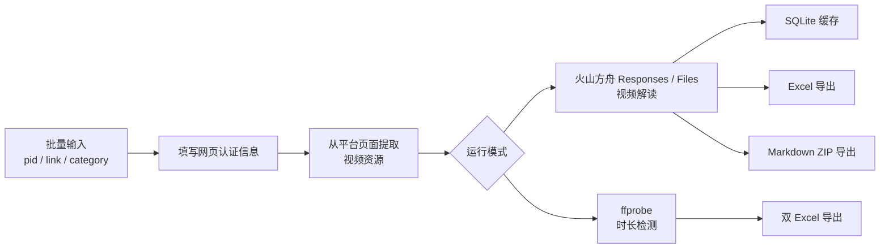

# video2prompt

<div align="center">

本地批量视频分析与 AI 解读工具


[功能亮点](#功能亮点) • [快速开始](#快速开始) • [运行模式](#运行模式) • [配置说明](#配置说明) • [macOS 打包](#macos-打包) • [开发](#开发) • [故障排查](#故障排查)

</div>

`video2prompt` 是一个本地运行的 Streamlit 应用，用来批量处理短视频平台内容并生成结构化分析结果。它会先从平台页面提取可访问的公开视频资源，再通过火山方舟 Responses / Files API 做视频解读；同时也支持基于 `ffprobe` 的时长检测模式，并将结果导出为 Excel 或 Markdown ZIP。

它适合这些场景：

- 批量生成视频复刻提示词
- 审查视频是否适合翻译搬运
- 按类目沉淀素材
- 快速筛掉超过 15 秒的视频

> [!IMPORTANT]
> 当前公开仓库聚焦于“批量视频分析与 AI 解读”这一通用能力展示；现阶段实现默认适配抖音视频链接，不支持 TikTok 链接，也不支持图集内容。

## 功能亮点

- 支持批量输入 `pid + 链接`，按类目模式额外支持类目字段
- 内置平台页面解析流程，不依赖额外解析服务
- 支持手动粘贴网页认证信息，并在本地持久化保存
- 仅保留火山方舟 Responses API / Files API 路径
- 内置四种运行模式：复刻提示词、翻译合规判断、按类目分析、视频时长判断
- 本地 SQLite 缓存，避免相同 `link + prompt` 重复调用模型
- 内置重试、退避、熔断、节奏控制和手动停止能力
- 所有模式支持 Excel 导出，按类目模式额外支持 Markdown ZIP
- 支持通过 `PyInstaller` 打包 macOS 桌面应用

## 工作流程



## 快速开始

### 依赖准备

- Python `3.11+`
- 可用的平台网页认证信息（当前实现中通常为抖音 Cookie）
- 如果要从源码运行视频时长判断模式，需要让 `ffprobe` 出现在 `PATH` 中
- 如果要使用 AI 解读模式，需要配置 `VOLCENGINE_API_KEY` 或 `ARK_API_KEY`

> [!NOTE]
> 视频时长判断模式不会调用模型，因此不需要 API Key，但仍然需要有效的平台网页认证信息。

### 1. 创建虚拟环境

```bash
python3 -m venv .venv
. .venv/bin/activate
python -m ensurepip --upgrade
python -m pip install --upgrade pip setuptools wheel
python -m pip install -e ".[dev]"
```

### 2. 创建 `.env`

```bash
cp .env.example .env
```

在 `.env` 中填写任意一个可用密钥：

```env
VOLCENGINE_API_KEY=your_volcengine_api_key_here
ARK_API_KEY=your_ark_api_key_here
```

### 3. 检查 `config.yaml`

应用从 `config.yaml` 读取运行时配置，包括火山方舟参数、解析并发、重试限制、熔断、缓存和日志。

最小示例：

```yaml
volcengine:
  base_url: "https://ark.cn-beijing.volces.com/api/v3"
  endpoint_id: "ep-xxxxxxxx"
  timeout_seconds: 300
  video_fps: 2.0
  thinking_type: "enabled"
  reasoning_effort: "high"
  input_mode: "auto"
  stream: true
```

> [!IMPORTANT]
> `volcengine.endpoint_id` 为必填项。

### 4. 启动应用

```bash
. .venv/bin/activate
bash scripts/start.sh
```

或者直接运行 Streamlit：

```bash
. .venv/bin/activate
python -m streamlit run app.py --server.headless=false
```

启动后，浏览器会打开本地页面。先在界面里粘贴并保存网页认证信息，然后再执行任务。

> [!IMPORTANT]
> `scripts/start.sh` 不会自动激活 `.venv`，请先手动激活虚拟环境。

## 运行模式

| 模式 | 输入 | 是否调用模型 | 输出 |
| --- | --- | --- | --- |
| 视频复刻提示词 | `pid + 链接` | 是 | 单个 Excel |
| 翻译合规判断 | `pid + 链接` | 是 | 单个 Excel |
| 按类目分析 | `pid + 链接 + 类目` | 是 | Excel + Markdown ZIP |
| 视频时长判断 | `pid + 链接` | 否 | 两个 Excel |

### AI 解读模式

`视频复刻提示词` 和 `按类目分析` 支持两种输出格式：

- `纯文本`：保留模型原始输出
- `JSON`：解析为结构化审查字段

`翻译合规判断` 固定使用 `JSON` 输出。

### 提示词行为

- `翻译合规判断` 默认使用 `docs/视频内容审查.md` 作为提示词模板
- `视频复刻提示词` 和 `按类目分析` 共用 `docs/视频复刻提示词.md`
- 提示词会按模式持久化到 SQLite，并在下次启动时恢复
- 普通模式的输出格式也会持久化并恢复

### 运行时覆盖

界面可以临时覆盖一些高频参数，仅对当前运行生效，例如：

- `parser.concurrency`
- `volcengine.video_fps`
- `volcengine.thinking_type`
- `volcengine.reasoning_effort`
- 输出格式

这些临时修改不会写回 `config.yaml`。

## 配置说明

### 环境变量

| 变量 | 用途 |
| --- | --- |
| `VOLCENGINE_API_KEY` | 主 API Key |
| `ARK_API_KEY` | 兼容的备用 API Key |

### 关键配置项

| 配置项 | 说明 |
| --- | --- |
| `volcengine.endpoint_id` | 必填的火山方舟 endpoint ID |
| `volcengine.input_mode` | 只支持 `auto`、`video_url`、`file_id` |
| `volcengine.video_fps` | 范围必须在 `0.2-5` |
| `volcengine.files_expire_days` | 范围必须在 `1-30` |
| `parser.concurrency` | 范围必须在 `1-50` |
| `retry.*_cap_seconds` | 必须 `>0` 且 `<=30` |
| `cache.db_path` | 从源码运行时默认是 `data/cache.db` |
| `logging.file_path` | 从源码运行时默认是 `logs/app.log` |

### 运行产物

从源码运行时，默认产物位置如下：

- 缓存数据库：`data/cache.db`
- 日志：`logs/app.log`
- 导出目录：`exports/`
- 上次运行快照：`exports/last_run_result.json`
- 认证信息持久化：`~/Library/Application Support/video2prompt/user_state.yaml`

## macOS 打包

当前分发目标是本地 macOS 应用包加 ZIP：

- `dist/video2prompt.app`
- `dist/video2prompt-macos.zip`

打包前准备：

```bash
. .venv/bin/activate
python -m pip install pyinstaller
chmod +x packaging/bin/ffprobe
```

执行打包：

```bash
bash scripts/build_macos_app.sh
```

打包后的应用首次启动时，会在 `~/Library/Application Support/video2prompt/` 下初始化可写文件，包括：

- `config.yaml`
- `.env`
- `data/`
- `logs/`
- `exports/`

> [!IMPORTANT]
> 构建需要在 `packaging/bin/ffprobe` 放置一个可分发的 macOS `ffprobe` 二进制。

> [!IMPORTANT]
> 当前生成的 macOS 应用尚未签名，也没有做 notarization。

> [!NOTE]
> 打包后的应用可以在没有 API Key 的情况下启动；只有真正发起 AI 请求时才会校验密钥。

## 开发

### 项目结构

```text
video2prompt/
├── app.py
├── config.yaml
├── .env.example
├── scripts/
│   ├── start.sh
│   └── build_macos_app.sh
├── packaging/
│   ├── video2prompt-macos.spec
│   └── bin/
│       └── ffprobe
├── src/video2prompt/
├── tests/
└── docs/
```

### 运行测试

全量测试：

```bash
. .venv/bin/activate
python -m pytest
```

常用定向测试：

```bash
. .venv/bin/activate
python -m pytest tests/test_config.py
python -m pytest tests/test_task_scheduler_output_format.py -k json
python -m pytest tests/test_task_scheduler_volcengine_retry.py
python -m pytest tests/test_markdown_exporter.py
python -m pytest tests/test_duration_check_runner.py
```

### 开发说明

- 这是一个单包 Python 项目，不是 monorepo
- UI 入口是 `app.py`，但大部分业务逻辑应放在 `src/video2prompt/` 下
- 仓库当前没有独立的 `ruff`、`black`、`mypy` 配置
- 修改调度器、配置、导出器、解析/模型客户端或 UI 状态流时，要同步更新对应测试

## 故障排查

### `依赖未安装，请先执行: pip install -e .`

通常表示虚拟环境未激活，或依赖尚未安装。

```bash
. .venv/bin/activate
python -m pip install -e ".[dev]"
```

### `未找到 .env`

从示例文件复制即可：

```bash
cp .env.example .env
```

### 视频时长判断模式提示 `ffprobe` 错误

说明系统缺少 `ffprobe`，或者它不在 `PATH` 中。

```bash
brew install ffmpeg
```

### 平台页面解析失败

最常见原因是网页认证信息过期。请从已登录的浏览器页面重新复制认证信息，并在界面中重新保存。

### 导出失败

优先检查：

- `docs/product_prompt_template.xlsx` 存在且可读
- `exports/` 可写
- 当前运行已经完成，并产出了可导出的结果

## 相关文档

- [需求说明](./docs/requirements.md)
- [按类目分析需求](./docs/requirements-v2-按类目分析.md)
- [视频复刻提示词](./docs/视频复刻提示词.md)
- [视频脚本拆解分析](./docs/视频脚本拆解分析.md)
- [视频内容审查](./docs/视频内容审查.md)
